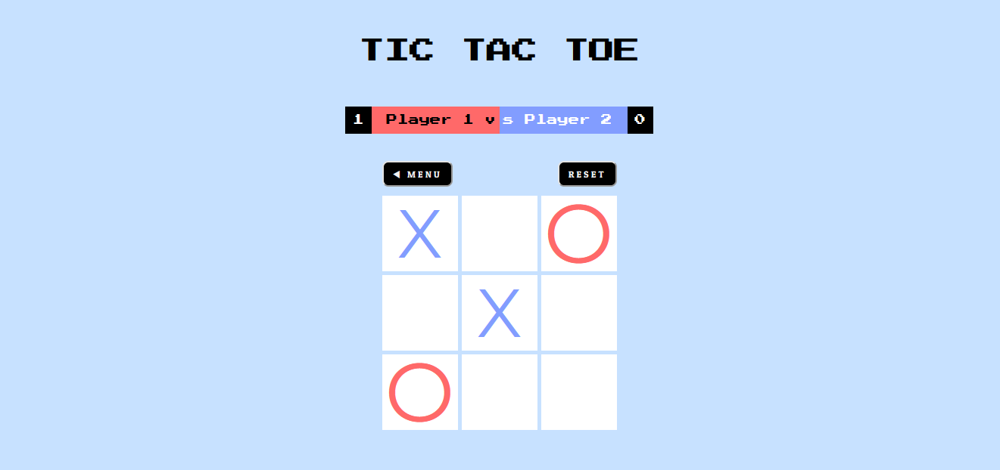

# Project: Tic Tac Toe
Tic Tac Toe game created using HTML, CSS and JavaScript.

Live preview [here](https://shiielty.github.io/tic-tac-toe/).

---
I want to say that I learn a lot, I mean A LOT from this project. Especially about design patterns like Revealing Module Pattern and Function Factory in JavaScript.  
I really glad I keep going through and finished this project! 